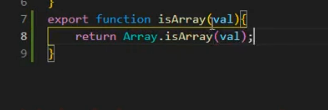
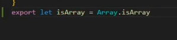
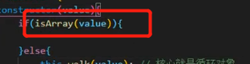
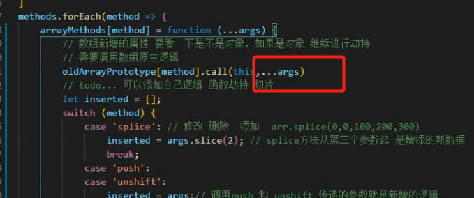
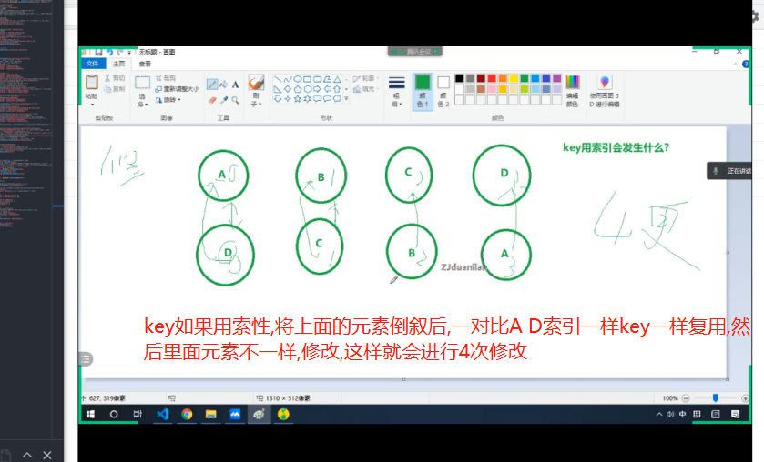
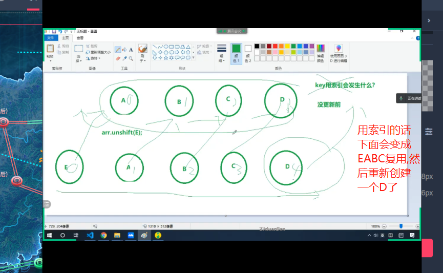

**所以陌生人，别贪心我们不可能什么都有，也别担心，我们不可能什么都没有，加油！**

## 一、3.15 学习总结

### 1、一些特殊的简写方式

1. 正常这样写
   
2. 可以简写
3. 使用

### 2、关于...剩余运算符

```JavaScript
  function a(v,...args) {
          console.log(args); //=>[2, 3]
			console.log(...args); //=>2 3
            if (3 > 2) {
                return console.log('return');
            }
          console.log(321);
        }
        a(1, 2, 3)
```

这个 args 单纯的只是一个形参 我取名 a b c 什么都可以只是 arg 是大家比较习惯取 只要是...这个运算符的作用
剩余参数是指函数定义时以...为前缀的参数，这个参数是一个没有对应形参的实参组成的一个数组，所以它与 arguments 有一定的区别，剩余参数中可以使用 push、map 等数组方法

### 3、闭包里面的 return

函数如果执行 return 后面代码是不会执行的 不管是函数里面套函数(错的只有 if 语句才会) 如上面 a 函数 console.log(321);永远不会执行
上面说的不对 上面是因为 if 语句 ; for循环也会退出函数
假如变成

```JavaScript
	 function a(){
			b()
			console.log(111);
		}

		function b(){
			if(3>2){
				return
			}
		}
		a()
		函数里面套函数会执行 控制台会打印111

		function a(){
			if(3>1){
				return console.log(222)
			}
			console.log(111);
		}

		function b(){
			if(3>2){
				return
			}
		}
		a() 这里就只会打印222了
        
        
        function get123() {
           for (let i = 0; i <=4; i++) {
                if (i === 4) return;
            }
            console.log(123); 
        }
         get123() 这里不会打印123
 
         	
         
        function get123() {
           for (let i = 0; i <=4; i++) {
                if (i === 4) break;
            }
            console.log(123); 
        }

        get123();
        // 123
 


```

### 4、关于 call 的一些问题


call 是可以接受好多参数的这里用...展开运算符把数组展开了
如果用 apply 的话 apply(this.args)就可以了 因为他可以第二个参数是一个数组
//如果 data 写的是函数 this 指向是 window 所以我们需要用 call 重置(对 call 的一个理解 call 里面如果写个 this 当第一个参数,意思就是谁调用他就谁当 this,不改变原来执行的 this)
//例子 arr.push.call(this) 那这个就是正常执行 push 方法原来的 this 其实 arr 这样写的好处是可以加多个参数因为 call 第二个参数可以是数组 arr.push.call(this,...args)
data = vm.\_data = isFunction(data) ? data.call(vm) : data;

## 二、3.23 学习总结

一天起码是要看好一天的内容的,如果遇到周末的课最少是看半天的 现在是 16 一共是 63 还有 47 之前是 15 号到 23 号看了 16 节 理论上还需要 23 天
加油吧 啊杰 最近刻苦程度不够啊 学的都变慢了 感觉

## 三、3.24 学习总结

文本节点科普

> 在 DOM 处理中一个普遍的错误是，认为元素节点包含文本。
> 不过，元素节点的文本是存储在文本节点中的。
> 在这个例子中：<year>2005</year>，元素节点 <year>，拥有一个值为 "2005" >的文本节点。
> "2005" 不是 <year> 元素的值！


## 四、3.29学习总结

#### 1、diff的key如果用索性会出现的情况
第一种就是正序变倒叙了   然后进行diff对比的时候发现div和key是一样的就复用然后儿子修改,但是如果key不用索性就只会移动DOM复用不需要更新儿子


第二种多出一个DOM

用索引就会 前面4个复用但是修改了儿子,然后重新加一个D 性能不好